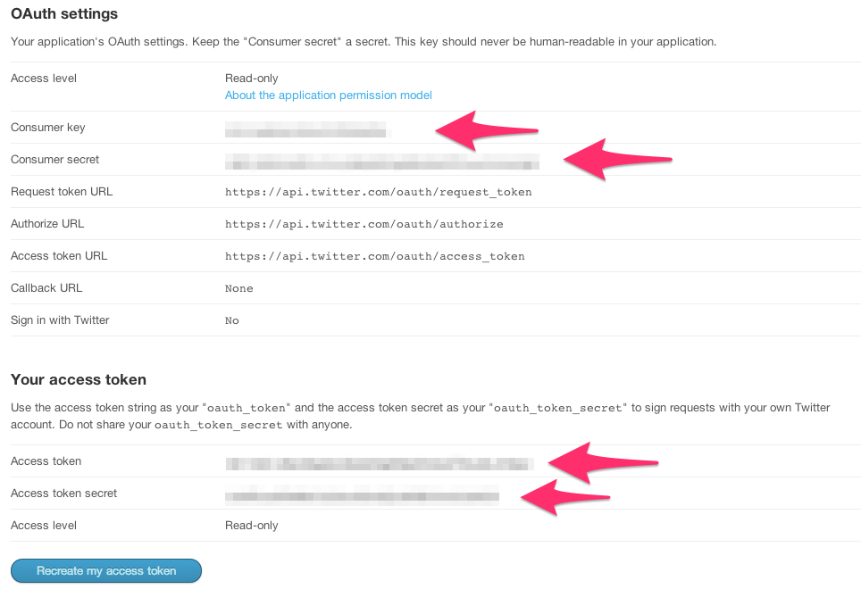

This is a small project I put together to experiment with the Twitter Streaming API. It pulls in all the Tweets in (approximately) the continental United States and displays them in real time on a map.

Demo
====

A demo is running at http://brandontilley.com:8080. Please feel free to contact me if the demo goes down!

Getting it to Work for You
==========================

You can run this on your own if you have Node.js installed.

1. Clone the repository
2. Install the dependencies:

        npm install

3. Run the server using your Twitter application credentials:

        TWITTER_KEY=consumer_key TWITTER_SECRET=consumer_secret TWITTER_TOKEN=access_token TWITTER_TOKEN_SECRET=access_token_secret npm start

   You'll need to register for an application at https://dev.twitter.com/apps/new to receive a consumer key and a consumer secret. Then, click 'Create my access token' to receive an access token and an access token secret.

   

By default the server binds to port 8080, so you can check it out at [http://localhost:8080](http://localhost:8080).

Note that, to conserve bandwidth, the application will stop streaming from Twitter if it detects that no clients are connected.
